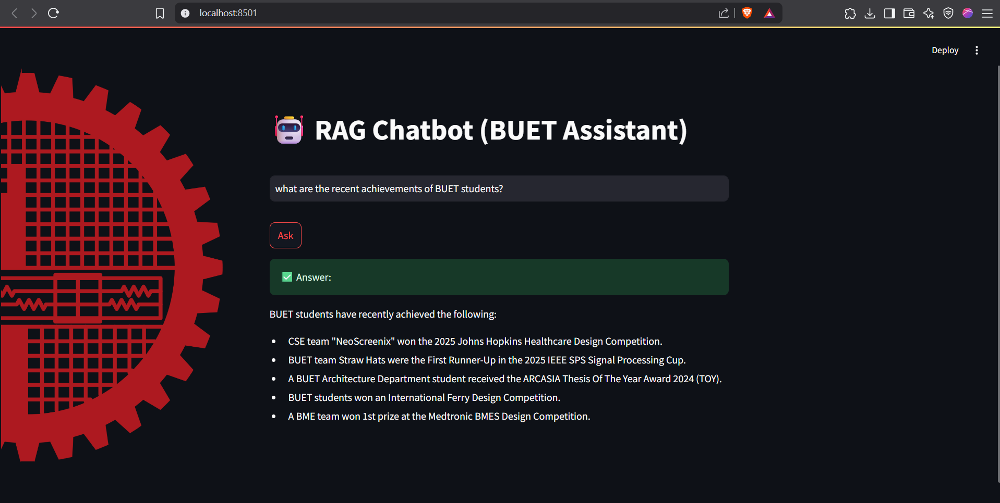

# 🤖 RAG Chatbot (BUET Assistant)

This is a bilingual (English & Bangla) chatbot built using **Retrieval-Augmented Generation (RAG)** powered by **LangChain** and **Gemini (Google Generative AI)**. The system can answer questions based on local `.txt` files (stored in a `docs` folder), and includes both a **FastAPI backend** and a **Streamlit frontend**.

---

## 🚀 Features

-  RAG-based document QA over local `.txt` files
-  FastAPI backend for processing queries and invoking Gemini
-  Streamlit frontend with custom background and modern UI
-  Supports both English and Bangla questions/responses
-  Uses Google's Gemini (`gemini-1.5-flash-latest`) , `embedding-001` model and LangChain framework 

---

Replace the API key with your own key.

## Run Backend (FastAPI)
From the project root:

```bash

uvicorn backend.backend:app --reload

```
## Run Frontend (Streamlit)
From the project root:

```bash
streamlit run frontend/frontend.py

```
<br>This is how it looks:<br>
</br>

